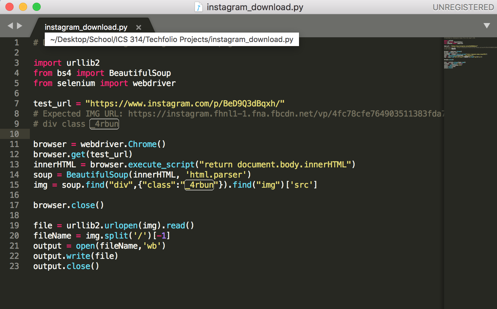
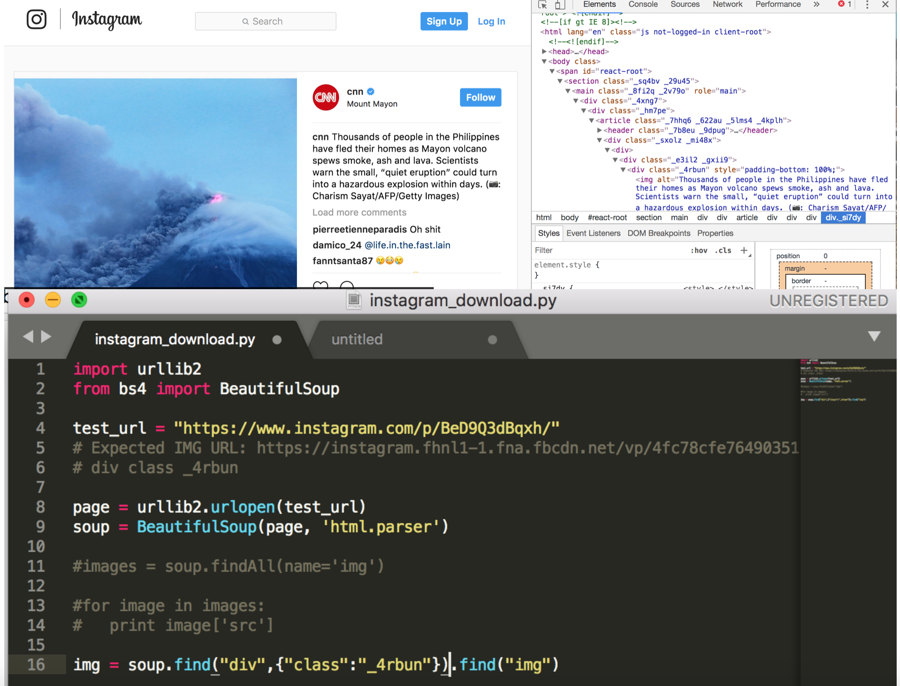

This is a quick little Instagram image downloader I made while looking for "fun projects to do" on google. Initially this project was merely a script for grabbing the instagram image from the React JS render but perhaps in the future I will add some front-end work and put it up as a web application.

My test script is was written in Python, one of my favorite languages for its ease-of-use and "straight to the point" style. Utilizing Selenium webdriver, a tool I've used in the past primarily for QA Testing, I was able to get to the img tag rendered by the JS upon loading the page. However this solution didn't present itself as easily as I had initially thought.

I remembered my friend asking me how one could download an image from Instagram. On both the mobile and desktop app there is no download button and each image is presented in such a way that you cannot "right click" on the image or "click and drag". Naturally, I used my Chrome devtools to inspect a picture on instagram. After feeling my way around the html I found what I was looking for- an img tag with the src of the original image. Being conveniently wrapped in the only div with the class "_4rbun" (making it unique), I assumed that this is how I would find the img tag and subsequently the img src. I double checked on other Instagram pages and other pictures to confirm that this was virtually true in all cases.

Upon finding my "solution" I immediately thought this was pretty straightforward. I would use urllib2 to grab the html from the page and find() the div with class: "_4rbun". However when I called find() it returned an empty list! Attempting to figure out why this was happening I replaced "_4rbun" with the class of the parent div and then that div's parent and repeated this many times until finally I reached a span element with the id "react-root". Bingo, my answer was there- the image was being rendered by js so the div I was looking for didn't exist in the html file! After this I knew I had to actually load the page to get to what I wanted and the rest was easy.
  
Eventually I re-wrote the url grabbing in JS using an entirely different method as well as adding a GUI so I could put it on the web. You can see the final product <a href="https://matthewlamdotjs.github.io/instagram_download/">here</a>.

Source Code: <a href="https://github.com/matthewlamdotjs/instagram_download">https://github.com/matthewlamdotjs/instagram_download</a>
