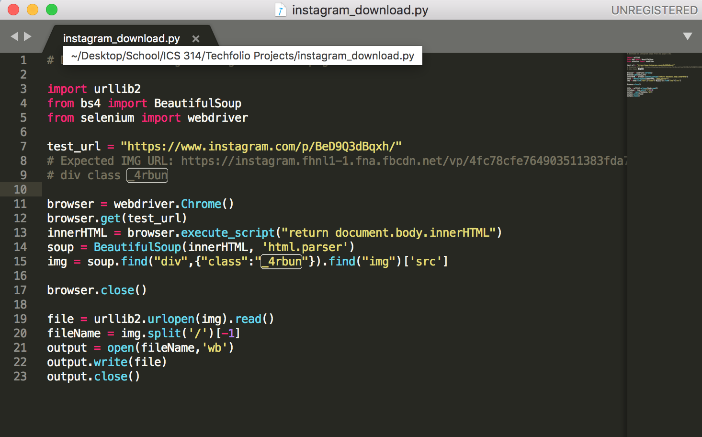
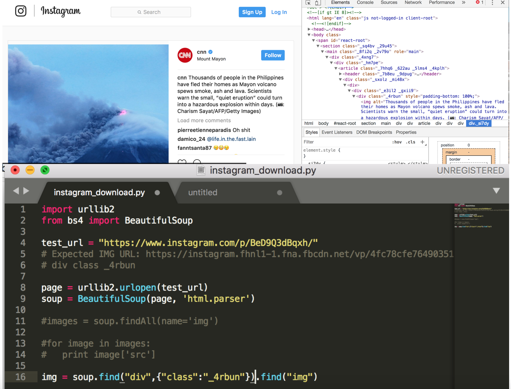

This is a quick little Instagram image downloader I made for the sake of having a project in my Techfolio. At this time this project is merely a script for grabbing the instagram image from the React JS render but perhaps in the future I will add some front-end work and put it up as a web application.

My script is written in Python, one of my favorite languages for its ease-of-use and "straight to the point" style. Utilizing Selenium webdriver, a tool I've used in the past primarily for QA Testing, I was able to get to the img tag rendered by the JS upon loading the page. This solution didn't present itself as easily as I had initially thought.

As I scrambled to create a quick project for my folio, I remembered my friend asking me how I could download an image from Instagram. On both the mobile and desktop app there is no download button and each image is presented in such a way that you cannot "right click" on the image or "click and drag". Naturally, I used my Chrome devtools to inspect a picture on instagram. After feeling my way around the html I found what I was looking for- an img tag with the src of the original image. Being conveniently wrapped in the only div with the class "_4rbun" (making it unique), I assumed that this is how I would find the img tag and subsequently the img src. I double checked on other Instagram pages and other pictures to confirm that this was virtually true in all cases.

Upon finding my "solution" I immediately thought this was pretty straightforward. I would use urllib2 to grab the html from the page and find() the div with class: "_4rbun". However find() returned an empty list! Attempting to figure out why this was happening I replaced "_4rbun" with the class of the parent div and did so many times until finally I reached a span element . Bingo, my answer was there- the image was being rendered by js so the div I was looking for didn't exist in the html file! After this I knew I had to actually load the page to get to what I wanted and the rest was easy.
  
This small project was a good reminder that I need to brush up on my skills since I haven't been in school for three years until this semester.

Source Code: <a href="https://github.com/mattlammmmm/instagram_download">https://github.com/mattlammmmm/instagram_download</a>
