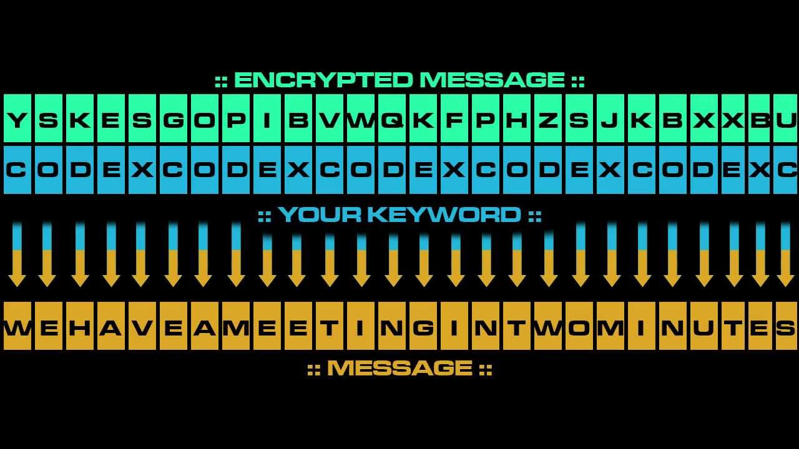

In my first year as a computer science student, I did a rudimentary implementation on a Vigenere cipher (using only letters A-F ignoring case) in Java. In an attempt to have more practical use, I modified my design to use an alphabet of printable ASCII characters not to include special characters (chars 32-126) and this time implemented the cipher using Python.

For those who aren't familiar, a Vigenere cipher encodes text using a key where the key repeats no longer than the message length. From there each character's place in the alphabet is shifted based on place of the corresponding key character in the alphabet. This can be represented mathematically as the sum of the two values. You can read more <a href="https://en.wikipedia.org/wiki/Vigen%C3%A8re_cipher">here</a>.



One of the first challenges I had here was being able to keep the char values in the range I wanted. My original code for encrypting a single char looked something like this:

```
numeric_value = ord(character)+ord(key[i%len(key)])
```
I knew I had to eventually modulo the range to keep the char values in range by doing ```% 94``` (126 - 32 = 94).
However this would not work since ```% 94``` on my char values as the were would cut off my range to 32-94. So first I would have to subtract 32 from the total sum of the message char and key char and then perform modulo

```
numeric_value = (ord(character)+ord(key[i%len(key)]) - 32) % 94
```
After performing modulo, it was necessary to add back the 32 in order to print the encrypted text correctly by pushing the values back into the printable range (chars 32 and above).

Decrypting involves the same processes but instead of adding the values, you subtract the key char value.

```
def encrypt(key, msg):
	msg_out = ''

	for i, c in enumerate(msg):
		numeric = (ord(c)+ord(key[i%len(key)])-32) % 94
		out_char = chr(numeric+32)
		msg_out += out_char

	return msg_out

def decrypt(key, msg):
	msg_out = ''

	for i, c in enumerate(msg):
		numeric = (ord(c)-ord(key[i%len(key)])-32) % 94
		out_char = chr(numeric+32)
		msg_out += out_char

	return msg_out
```

This small project made me more familiar with ASCII values and was also a good excercise in representing Math with code.


Source Code: <a href="https://github.com/mattlammmmm/vigenere">https://github.com/mattlammmmm/vigenere</a>
